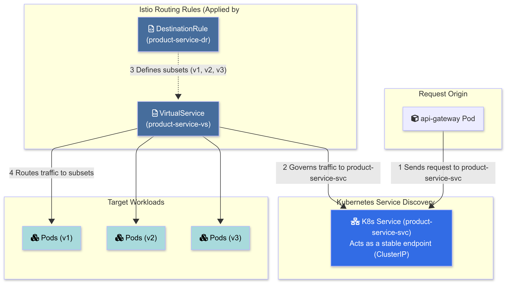

# Design, Implementation, and AI­Driven Optimization of an E­Commerce Platform using Microservices Architecture and DevOps Principles

---

## 🏗 System Architecture

The system is designed as a distributed cloud-native application comprising 12 independent microservices. It leverages a **Polyglot Persistence** strategy and an **Event-Driven Architecture (EDA)** via Apache Kafka.


### Key Architectural Patterns
*   **BFF (Backend for Frontend):** The API Gateway enriches payloads (e.g., fetching product details for orders) to simplify client logic.
*   **Event-Driven Communication:** Services communicate asynchronously via Kafka to ensure loose coupling and eventual consistency.
*   **Polyglot Persistence:** Each service selects the optimal database (PostgreSQL for relations, Redis for caching, Elasticsearch for search).
*   **Sidecar Pattern:** Istio Envoy proxies manage traffic, security, and observability transparently.


---

## 🧠 AI-Driven Load Balancing

The core innovation of this project is the **AI Controller**, a Python-based component that acts as an intelligent control plane for the Service Mesh.

### How it Works (Q-Learning)
The agent uses **Reinforcement Learning** to learn optimal routing policies. It follows a continuous feedback loop:
1.  **Observe:** Scrapes metrics (Latency, RPS, Error Rates) from **Prometheus**.
2.  **Decide:** Uses a Q-Table (Epsilon-Greedy strategy) to select the best traffic split action.
3.  **Act:** Patches **Istio VirtualServices** to adjust traffic weights dynamically.
4.  **Learn:** Calculates reward based on system performance and updates the Q-Table.


### Operational Flow


---

## 🛠 Tech Stack

| Domain | Technologies |
| :--- | :--- |
| **Backend** | Node.js, Express.js |
| **AI/ML** | Python, NumPy, Pandas, Scikit-learn |
| **Databases** | PostgreSQL (Prisma ORM), Redis, Elasticsearch |
| **Messaging** | Apache Kafka, Zookeeper |
| **Infrastructure** | Docker, Kubernetes (Kind) |
| **Service Mesh** | Istio (Envoy Proxy, Istiod) |
| **DevOps** | Jenkins, Git |
| **Observability** | Prometheus, Grafana, Kiali |

---

## 🧩 Microservices Breakdown

### 1. Core Business Services
*   **Auth Service:** Manages JWT authentication and RBAC (Roles/Permissions).
    *   *Schema:* 
    *   *Flow:* 
*   **Product Service:** Manages catalog, inventory, and dynamic pricing.
    *   *Schema:* 
*   **Order Service:** Handles order lifecycle and denormalizes data for performance.
    *   *Schema:* 
    *   *Security:* Uses a payload enrichment pattern to prevent price manipulation.
    *   *Diagram:* 

### 2. Support & Utility Services
*   **Cart Service (Redis):** High-speed shopping cart management.
    *   *Flow:* 
*   **Search Service (Elasticsearch):** Full-text search engine synchronized via Kafka.
    *   *Flow:* 
*   **Payment Service:** Simulates payment processing and compensating transactions.
    *   *Flow:* 
*   **Notification Service:** Sends transactional emails triggered by Kafka events.
    *   *Flow:* 

---

## 🚀 DevOps & Infrastructure

### CI/CD Pipeline
The project utilizes a dual-pipeline strategy in **Jenkins**: one for Infrastructure (Idempotent Setup) and one for Application Deployment.


### Service Mesh & Observability
We use **Istio** for traffic management and **Kiali** for visualizing the mesh topology.

*   **Istio Traffic Control:**
    
*   **Kiali Traffic Graph:**
    
*   **Grafana Dashboard:**
    

---

## 📊 Experimental Results

We compared the **Baseline (Static Round-Robin)** against the **AI-Controlled (Q-Learning)** approach under various load scenarios using **k6**.

### Experiment 1: Moderate Load (40 VUs)
The AI agent successfully smoothed out latency spikes that destabilized the baseline.


### Experiment 2: High Load (100 VUs)
**Result:** The Baseline system suffered a catastrophic failure (flatline). The AI system degraded gracefully, maintaining throughput and availability.


### Experiment 3: Read-Intensive Load (200 VUs)
After a brief "learning phase" (exploration), the AI agent converged on an optimal policy, achieving **45% lower P99 latency** than the baseline.


---

## 💻 Application Showcase

**Storefront:**


**Product Details:**


**Order Management:**


**Admin Dashboard (Stats Service):**


**RBAC Management:**


---

## ⚙️ Installation & Setup

### Prerequisites
*   Docker & Docker Compose
*   Kind (Kubernetes in Docker)
*   Kubectl & Istioctl

### Quick Start

1.  **Clone the repository:**
    ```bash
    git clone https://github.com/your-username/lirmm-ecommerce.git
    cd lirmm-ecommerce
    ```

2.  **Bootstrap the Cluster:**
    Run the setup script to create the Kind cluster and install Istio.
    ```bash
    ./kind-deployment/setup-kind.sh
    ```
    

3.  **Deploy Infrastructure:**
    ```bash
    kubectl apply -f kind-deployment/infra-manifests.yaml
    ```

4.  **Deploy Microservices:**
    ```bash
    kubectl apply -f kind-deployment/app-manifests.yaml
    ```

5.  **Start the AI Controller:**
    ```bash
    cd ai-controller
    python3 control_loop.py
    ```

6.  **Access the App:**
    The application is exposed via NodePort. Visit `http://localhost:3000`.

---

## 🔮 Future Work
*   **Deep Q-Networks (DQN):** To handle continuous state spaces and more complex metrics.
*   **Predictive Scaling:** Integrating LSTM models to forecast traffic spikes before they happen.
*   **Cloud Migration:** Moving from Kind to a managed cluster (EKS/GKE) with persistent storage volumes.

---

## 📜 License
This project is part of an engineering thesis.
Copyright © 2025 Harche Samir.
